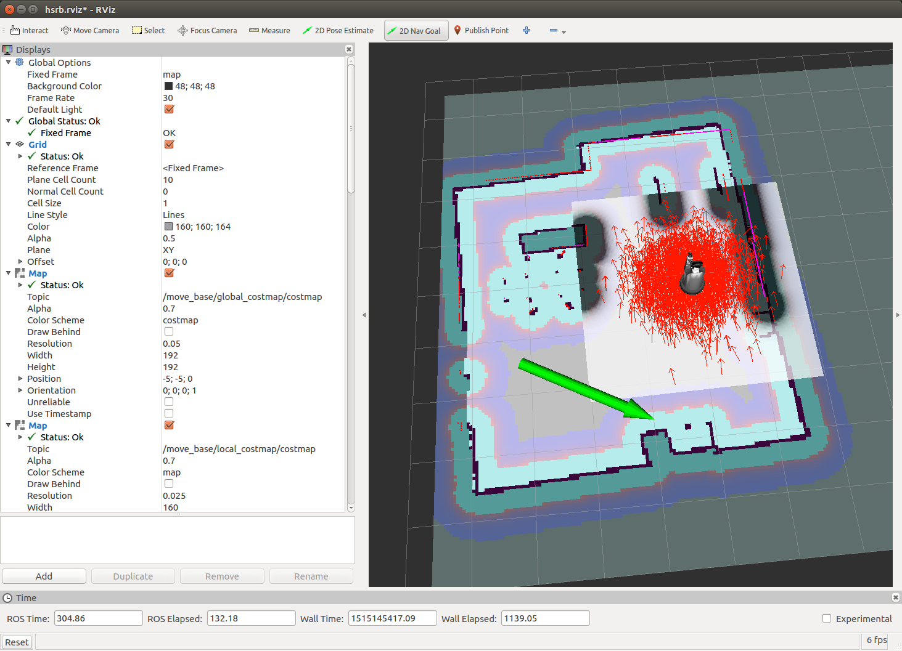
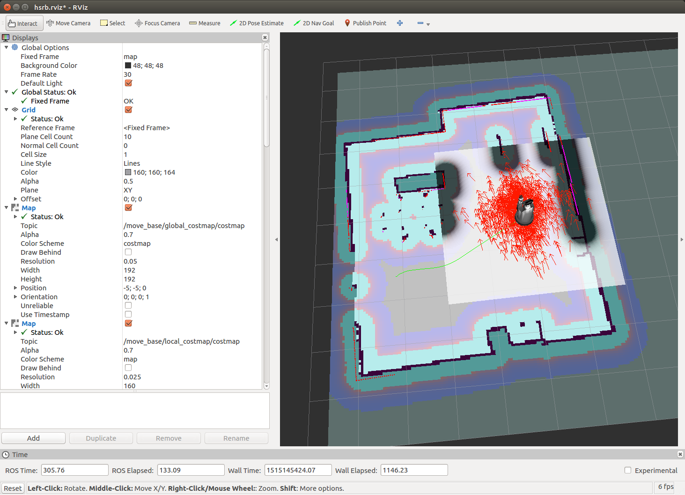
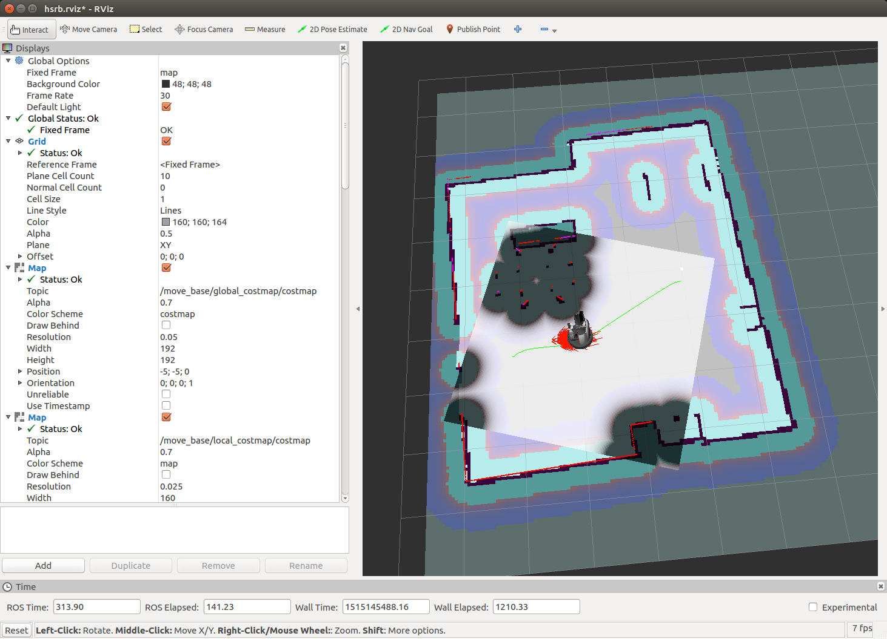
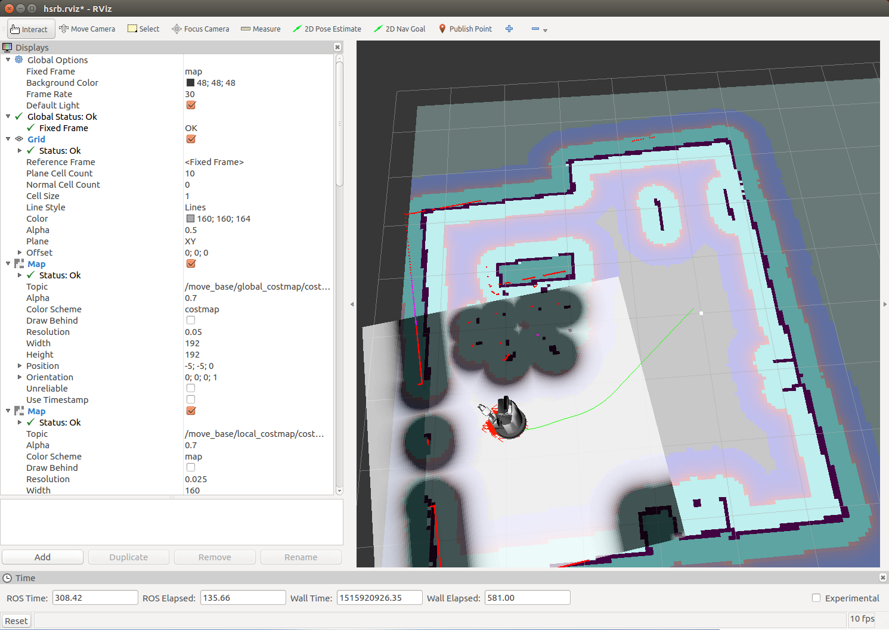
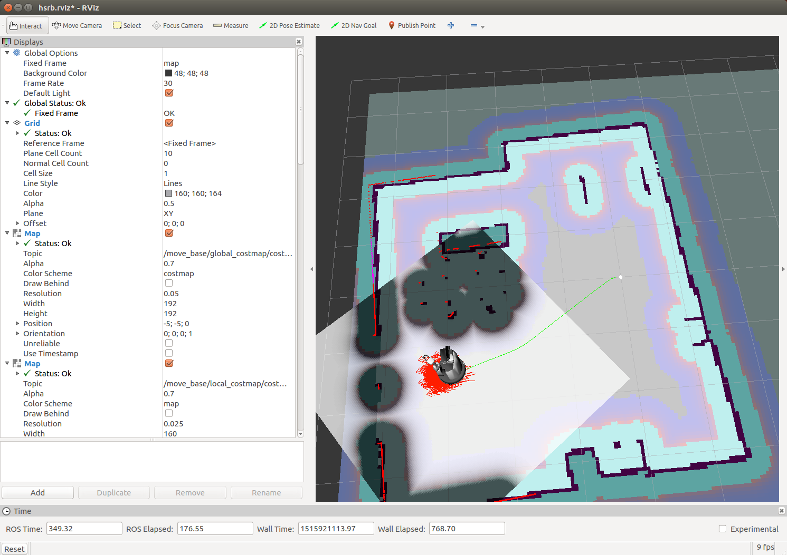

# Autonomous movement - navigation

Using the HSR ROS autonomous movement package hsrb\_rosnav\_conf, you can perform autonomous movement within the environment space.


## Software startup

### In the case of a simulator

Start up the HSR Gazebo simulator and RViz.  If it is still running from "Map creation", then it is not necessary to start it again.

**Terminal #1**

```
$ roslaunch hsrb_rosnav_config simple_gazebo_world.launch gui:=true rviz:=true
```

- **Memo** : `gui:=true` is the setting that indicates that the Gazebo simulator GUI should be displayed.  If graphics processing is slow, then it is possible to turn off only the simulator GUI by setting `gui:=false` (this is the default, so not specifying it would do the same).

Run the autonomous movement program.  If it is the case that the sample map prepared in the hsrb\_rosnav\_conf package will be used, then execute the following command.

**Terminal #2**

```
$ roslaunch hsrb_rosnav_config hsrb_nav.launch
```

If you will use the map that was saved and moved to `~/.ros/` in the previous section ("Map creation"), then specify the `map_file` option setting it to `map.yaml` and execute it as follows.

```
$ roslaunch hsrb_rosnav_config hsrb_nav.launch map_file:=map.yaml
```


### In the case of a real robot

Make a ROS terminal environment by using `hsrb_mode`, then stop the `/pose_integrator` node.  If `/pose_integrator` was already stopped in the previous section ("Map creation"), then is is not necessary to stop it again.

**Terminal #1**

```
$ hsrb_mode
$ rosnode kill /pose_integrator
```

Start RViz.
If it was still running from "Map creation", then it is not necessary to restart it.

```
$ rviz -d $(rospack find hsrb_rosnav_config)/launch/hsrb.rviz
```

Afterwards, execute the autonomous movement program in the same way as the simulation.  Because we will use the map of the actual environment that was saved in the previous section ("Map creation"), we will specify the `map_file` option setting it to `map.yaml` and execute it as follows.

**Terminal #2**

```
$ roslaunch hsrb_rosnav_config hsrb_nav.launch map_file:=map.yaml
```


## Robot initial position configuration

The robot at startup time does not know where it is at on the map.  Using RViz pass the robot's initial position and initial posture on the map.

1. Click **2D Pose Estimate** located in the upper part of RViz.
2. Specify the direction by clicking at the goal location inside of the RViz robot's space then dragging it.

The RViz robot's position and posture is set to the specified point.

If the map's robot location and the real environment's robot location match, then the map's wall and the shape of the laser sensor detection point group will match.  It gives the initial position many times until it is familiar, and it will be necessary for a matching position and posture to become near.  Because if there are several degrees of slope and about 1[m] of gap, then correcting it while it is repeatedly performing self-position estimation (localization) it is not so necessary to make it match.


## Autonomous movement in RViz

Performing robot autonomous movement from the RViz interface.

Specify a target position and direction where the robot moves to autonomously in RViz.

1. Click **2D Nav Goal** located in the upper part of RViz.
2. Specify the direction by clicking at the goal location inside of the RViz robot's space then dragging it.



If the robot's goal location and direction are specified, then the route where the "cost" is minimized according to the costmap is planned and autonomous movement begins.  In the costmap, the closer an obstacle the higher the cost and the farther away an obstacle the lower the cost.



A local costmap based on the sensor information is updated with the movement and the route is revised appropriately.

Although large modifications are not made to this operation example image, in the case that the additional obstacles that were read from a save file were detected by the laser sensor, then the route that is reflected in the local costmap is avoided and replanned.



It arrives at the goal location and direction, then autonomous movement stops.


This is the state where Gazebo is at the stage where autonomous movement has stopped.


Please move the robot by way of the destinations at various places in the map.  When there is an obstacle on the route or at the goal, although planning fails, for other cases the robot should arrive at its destination.

## Autonomous movement from a program

Perform robot autonomous movement from a program.
There are 2 main paths for autonomous movement methods using programs.

- The method that uses messages.
- The method that uses actionlib.

If it is the case that you will be moving a real robot, please do so while heeding the following.

- **Warning #1** : In the case of a real robot, please execute `hsrb_mode` when you start each terminal.
- **Warning #2** : In the case of a real robot, please execute commands while carefully confirming movement environment and the situation.

### Method using messages

It can be simple to use the method that uses messages.


#### Message confirmation

The topic to receive a position and the direction of the goal of the autonomous movement is `move_base_simple/goal`.  The message type is `geometry_msgs/PoseStamped`.

First, while displaying the topic message using `echo`, using the same procedure as the previous item specify the destination using the mouse in RViz, then try to verify the movement.

While the real robot and RViz, or Gazebo and RViz, is executing along with a navigation program, execute the following command and display the topic.

```
$ rostopic echo move_base_simple/goal
```

At the outset, `WARNING` is output because there is no topic published yet, however, this is not a problem at this point in time.

```
$ rostopic echo move_base_simple/goal
WARNING: no messages received and simulated time is active.
Is /clock being published?
```

If it specifies the robot's goal location and direction using RViz's "2D Nav Goal", then the following `header:` topic is published and is displayed to the terminal where `echo` was executed.

```
$ rostopic echo move_base_simple/goal
WARNING: no messages received and simulated time is active.
Is /clock being published?
header:
  seq: 0
  stamp:
    secs: 280
    nsecs: 239000000
  frame_id: "map"
pose:
  position:
    x: -1.5407705307
    y: 3.07256913185
    z: 0.0
  orientation:
    x: 0.0
    y: 0.0
    z: 0.915301702633
    w: -0.402768907882
---
```

It is understood that the location (position) and the posture (orientation) in the map are given by the message.  This topic can set a destination from the program by publishing a message.


#### Example program that uses messages

Try to look at `send_goal_message.py` -- a sample program that sends autonomous movement goal position messages.

The following content mainly relates to autonomous movement.

- The configuration of the `/move_base_simple/goal` topic this is published.
- Goal position and posture configuration : map position coordinates `x=-1.5`, `y=3.0`, `yaw=0.0` (yaw is a quaternion expression).
- Destination topic publication.

**send_goal_message.py**

```python
#!/usr/bin/env python

import rospy
from geometry_msgs.msg import PoseStamped

if __name__ == '__main__':

    rospy.init_node( 'send_goal_message', anonymous=True )
    pub = rospy.Publisher( '/move_base_simple/goal', PoseStamped, queue_size=1 )

    # wait for /clock for simulation
    rospy.sleep(1)

    msg = PoseStamped()
    msg.header.stamp = rospy.Time.now()
    msg.header.frame_id = "map"
    msg.pose.position.x = -1.5
    msg.pose.position.y = 3.0
    msg.pose.orientation.w = 1.0

    print( msg )
    pub.publish( msg )

```

Try to execute the sample program.

```
$ rosrun nsrb_navigation send_goal_message.py
```

We think that it moved to the map position cooridinate `x=-1.5`, `y=3.0`.


### Posture specification - Quaternion

A Quaternion is used to express rotation in ROS.  Quaternions are not intuitive, however, for those calculations the **Eulerian angle/Quaternion conversion tool** can be used.

The following is a usage example of the Quaternion conversion tool on the Python console.

```python
$ python
>>> import math
>>> from tf import transformations
>>> transformations.quaternion_from_euler(0,0,0)
array([ 0.,  0.,  0.,  1.])
>>> transformations.quaternion_from_euler(0,0,math.pi/2)
array([ 0.        ,  0.        ,  0.70710678,  0.70710678])
```

The robot reference coordinate system of the HSR is as listed below.
As far as it moves across a horizontal floor, the base part's rotation is  the Z axis (yaw) which is rotation only.

 Axis | Positive | Negative | RViz display
--:|:---:|:---:|:--
 X | Forwards | Backwards | Red
 Y | Left | Right | Green
 Z | Up | Down | Blue


The program example send_goal_message_rotate.py that uses the Quaternion conversion is listed below.

**send_goal_message_rotate.py**

```python
#!/usr/bin/env python

import rospy
from geometry_msgs.msg import PoseStamped

import math
from tf import transformations

if __name__ == '__main__':

    rospy.init_node( 'send_goal_message', anonymous=True )
    pub = rospy.Publisher( '/move_base_simple/goal', PoseStamped, queue_size=1 )

    # wait for /clock for simulation
    rospy.sleep(1)

    msg = PoseStamped()
    msg.header.stamp = rospy.Time.now()
    msg.header.frame_id = "map"
    msg.pose.position.x = -1.5
    msg.pose.position.y = 3.0

    q = transformations.quaternion_from_euler( 0.0, 0.0, math.pi/2 )
    msg.pose.orientation.x = q[0]
    msg.pose.orientation.y = q[1]
    msg.pose.orientation.z = q[2]
    msg.pose.orientation.w = q[3]

    print( msg )
    pub.publish( msg )

```
Execute the program example send_goal_message_rotate.py that uses the Quaternion conversion.

```
$ rosrun hsrb_rosnav_config send_goal_message_rotate.py
```




### Method using actionlib

The method for using the `/move_base_simple/goal` topic is simple, but it cannot know whether or not autonomous movement was canceled midway or whether or not the robot arrived at its destination.

For that reason, as the higher grade autonomous movement destination specification method, the **actionlib** approach is often used.

An example program that uses actionlib is listed below.

**send_goal_action.py**

```python
#!/usr/bin/env python

import rospy, actionlib
from move_base_msgs.msg import *

if __name__ == '__main__':

    try:
        rospy.init_node( 'send_goal', anonymous=True )
        client = actionlib.SimpleActionClient( 'move_base', MoveBaseAction )
        client.wait_for_server()

        goal = MoveBaseGoal()
        goal.target_pose.header.stamp = rospy.Time.now()
        goal.target_pose.header.frame_id = "/map"
        goal.target_pose.pose.position.x = -1.5
        goal.target_pose.pose.position.y = 3.0
        goal.target_pose.pose.orientation.w = 1.0

        print( goal )
        client.send_goal( goal )

        finished = client.wait_for_result()
        print( "Finished : {}".format( finished ) )

    except rospy.ROSInterruptException:
        pass
```

We will explain each part of the program.

Initialize the ROS node and the SimpleActionClient of the actionlib.

```python
rospy.init_node( 'send_goal', anonymous=True )
client = actionlib.SimpleActionClient( 'move_base', MoveBaseAction )
client.wait_for_server()
```

Set the coordinate of the destination and send it from the actionlib client to the actionlib server.

```python
goal = MoveBaseGoal()
goal.target_pose.header.stamp = rospy.Time.now()
goal.target_pose.header.frame_id = "/map"
goal.target_pose.pose.position.x = -1.5
goal.target_pose.pose.position.y = 3.0
goal.target_pose.pose.orientation.w = 1.0

print( goal )
client.send_goal( goal )
```

Wait for the end of the action, then when it is finished
receive the result and display it.

```python
finished = client.wait_for_result()
print( "Finished : {}".format( finished ) )
```

Execute the example program that uses actionlib.

```
$ rosrun hsrb_rosnav_config send_goal_action.py
```




## Stopping the software

Stop them by entering Ctrl-C into each terminal that started a program.


<!-- EOF -->
